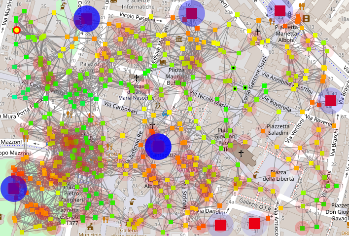
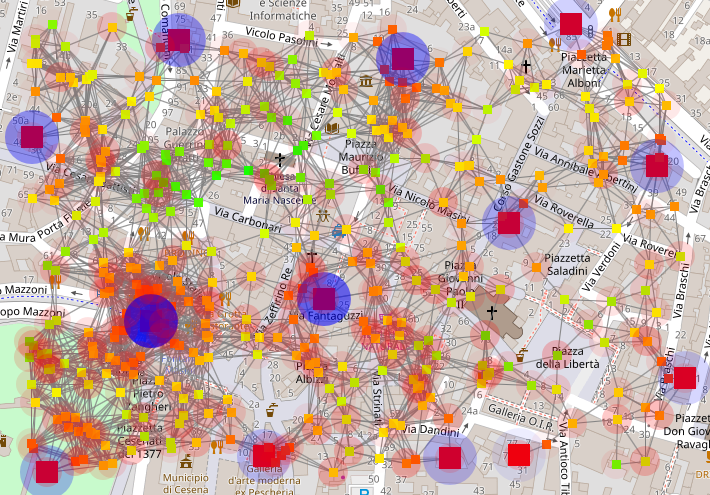
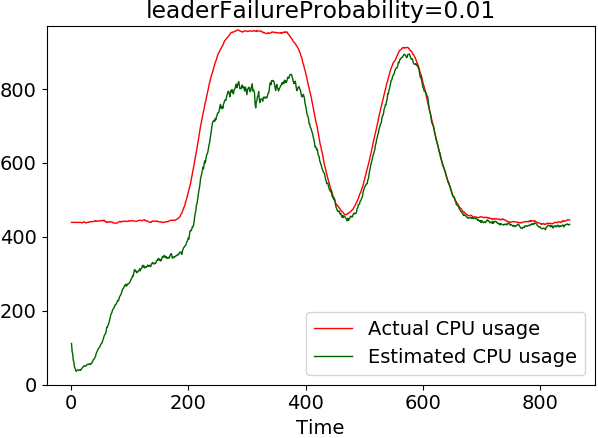
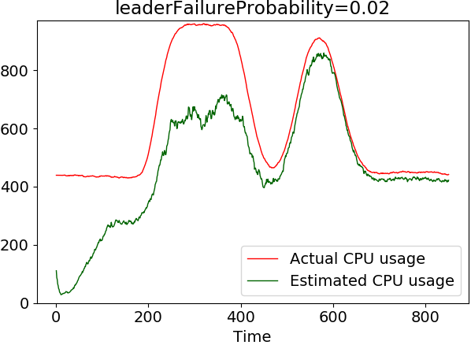

# Aggregate Programming in Scala with SCAFI

This is the project repository for the case study
 presented in homonym manuscript submitted to ACM TOPLAS.

## Structure of the repository

The project has the standard structure of Maven/Gradle projects.

* `./build.gradle` contains the build definition and the tasks for compiling and packaging the application
* `./src/main/scala/it/unibo/casestudy/AdHocCloud.scala` contains the **source code of the case study**
* `./src/main/yaml/adhoccloud.yml` contains the **configuration of the Alchemist simulation**
* `./plotter.py` is a script that can be used to plot data produced by Alchemist
* `./history/` contains, for different simulations, the corresponding configuration files

## How-to

A simulation can be started with a command as the following:

```bash
$ ./gradlew --no-daemon && \
  java -Xmx5024m -cp "build/classes/main:libs/alchemist-redist-7.0.2-beta.jar:libs/scafi-lib-assembly-0.3.0.jar:build/resources/main" \
  it.unibo.alchemist.Alchemist \
  -b -var random leaderFailureProbability \
  -y src/main/yaml/adhoccloud.yml -e data/20181010_exp -t 400 -p 3 -v &> exec.txt &
```

where

* `./gradlew --no-daemon` is used to compile and build the simulation source code
* `java -cp "..." it.unibo.alchemist.Alchemist` sets the java classpath and the main class to run
* `-b -var <var1> <var2>` sets batch mode, and the given variables are combined to form a matrix of simulation configurations to run
* `-y <file>` specifies the configuration for the simulation to run (which describes variables, i.e., input parameters, and exports)
- `-e <basefilepath>` specifies the base filepath for generating data output files
- `-t 400` specifies the logical time to be simulated; `-p <N>` specifies the number of parallel simulations to run;
- `-v &> exec.txt &` sets the logging level as verbose and redirect output to a text file (e.g., for debugging purposes) and starts the task in background

Once data files (which are in CSV format) are generated, you can use script `plotter.py` to create plots.

```bash
# ./plotter.py <dir> <baseFilepath> <plotConfigFile>
$ ./plotter.py data 20181010_exp plotconfig.yml
```

where `plotconfig.yml` is something as the following:

```yaml
the_plots_labels: # these should map the 'export fields'
  - Time
  - Available CPU
  - Actual CPU usage
  - Estimated CPU usage
  - Nfailures
  - Nleaders
the_plots_formats: # the plots to be created, and which fields to be selected
  - [0,2,3,4,5]    # the first field is used for X-axis; the others appear as curves
line_widths:
  - [1,1,1,1,1,1]
default_colors: &default_colors ["black","blue", "red","darkgreen","orange","violet"]
the_plots_colors:
  - *default_colors
legend_position:
  - "lower right"
sampling: True # when true, you use a 'random' (batch) dimension to unify multiple files and averaging the curves

```

## Reproducing the experiments

NOTE: this may take a few hours.

In the paper, Fig. 12 shows, for different `leaderProbabilityFailure` values, the estimated CPU usage
 against the actual CPU usage, taking the mean values of 30 runs with varying random seeds.
These plots can be re-generated with the following commands:

```bash
$ git fetch --all --tags --prune
$ git checkout tags/fig12 -b fig12

$ ./gradlew --no-daemon && \
 java -Xmx5024m -cp "build/classes/main:libs/alchemist-redist-7.0.2-beta.jar:libs/scafi-lib-assembly-0.3.0.jar:build/resources/main" \
 it.unibo.alchemist.Alchemist \
 -b -var leaderFailureProbability random \
 -y history/fig12/adhoccloud.yml \
 -e data/fig12 -t 850 -p 3 -v &> exec.txt &

$ ./plotter.py data fig12 history/fig12/plot.yml
```

## Pictures in the paper

### Simulation scenario

Visual representation of the scenario, with two snapshots taken before and after a hot update of the metric.
The big red squares represent leader nodes. Superimposed with any leader is a semi-transparent blue ball 
whose intensity is proportional to the amount of resources available in the corresponding area. 
Other nodes have a colour representing the gradient field towards leaders 
(warmer, red-like colours for nodes close to the leader, and colder, green-like colours for peripheral nodes).
The updated metric in the latter provides an overestimation of distances which results 
 in smaller areas or, equivalently, in more cloudlets (and leaders).





### Evaluation

These graphs show the load estimation capability at leader nodes,
for different round-wise probabilities of leader failure 
(leading to a disproportionate  number of failures (`150` to `250`) in the considered timespan). 
The plots are obtained by taking the mean of `30` runs with different random seeds.
The scenario is modelled as follows: the spikes of high load start at time `t=200` and `t=500`, 
the new metric is injected at time `t=450`, and we can observe that, 
 after such upgrade, the system is able to perform a much more precise estimation of CPU usage.





## Contacts

* Roberto Casadei: roby [dot] casadei [at] unibo [dot] it

## Links

* [ScaFi repository](https://github.com/scafi/scafi)
* [ScaFi website](https://scafi.github.io/)
